# Jaehoon Song
**Software Engineer | Manufacturing & Web Systems**

Professional experience in building backend architectures, database systems, and automated CI/CD pipelines. Focused on delivering production-ready integrations and solving complex system challenges through rigorous engineering and mathematical problem-solving.

Detailed project documentation, full professional experience, and technical insights are available at:
- Online Portfolio: [yundaeleesong.github.io](https://yundaeleesong.github.io/)
- [Full CV (Comprehensive)](https://yundaeleesong.github.io/references/cv-JaehoonSong.pdf)
- [Technical Resume (Tech-focused)](https://yundaeleesong.github.io/references/resume-JaehoonSong.pdf)

---

### Technical Expertise

I possess a comprehensive skill set spanning system-level programming, scalable backend architectures, interactive frontends, and automated CI/CD pipelines. The following breakdown highlights the languages, frameworks, and tools I use to build robust and efficient solutions across different domains.

- **AI & IDEs** — Leveraging modern AI tools and IDEs to accelerate development, ensure code quality, and improve overall productivity.
  **Android Studio** **Cursor IDE** **OpenAI API** **Claude CLI** **Gemini CLI** **Copilot Agent**
- **Programming Languages** — Experienced in developing robust systems using a diverse set of programming languages tailored to specific project needs.
         
- **Software Engineering** — Applying core computer science principles, design patterns, and agile methodologies to build scalable and maintainable software.
- **Server Development with Spring Boot** — Building enterprise-grade backend services and RESTful APIs utilizing the Spring Boot ecosystem.
      
- **Server Development with Java** — Creating lightweight and efficient Java-based middleware and server applications.
   
- **Server Development with Python** — Developing rapid and scalable backend APIs using modern Python frameworks.
      
- **Web Development with Jakarta EE** — Maintaining and developing enterprise web applications using Jakarta EE standards.
- **Web Development with Angular** — Crafting dynamic and responsive single-page applications using Angular and TypeScript.
      
- **Web Development with React** — Building interactive user interfaces and component-driven web applications with React.
  
- **Desktop Development** — Designing native and cross-platform desktop applications with rich graphical user interfaces.
     
- **Graphics and Game Development** — Developing interactive 2D/3D graphics applications and exploring game engine architectures.
   
- **Mobile Development** — Creating native mobile experiences with modern SDKs and architectural patterns.
   
- **Data Science and Visualization** — Analyzing datasets and creating compelling visual representations of complex data.
   
- **Databases** — Designing, optimizing, and managing relational databases for high-performance applications.
    
- **DevOps and Infrastructure** — Deploying and managing containerized applications and server infrastructure.
    
- **CI/CD and Automation** — Automating build, test, and deployment pipelines to ensure continuous delivery.
      
- **Documentation** — Maintaining comprehensive technical documentation for codebases and APIs.
   

<table align="center" border="0" cellpadding="0" cellspacing="0">
  <tr>
    <td valign="top">
      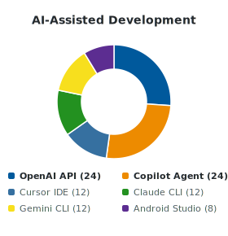
    </td>
    <td valign="top">
      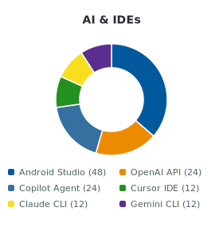
    </td>
    <td valign="top">
      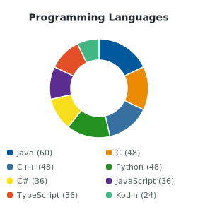
    </td>
  </tr>
  <tr>
    <td valign="top">
      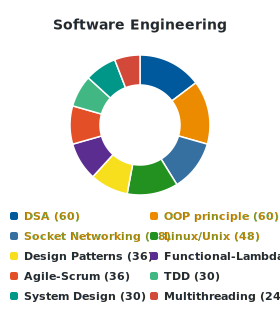
    </td>
    <td valign="top">
      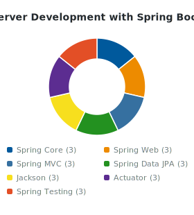
    </td>
    <td valign="top">
      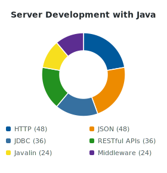
    </td>
  </tr>
  <tr>
    <td valign="top">
      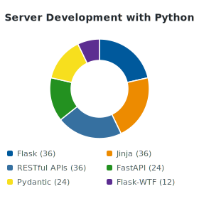
    </td>
    <td valign="top">
      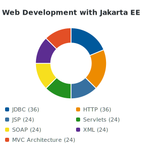
    </td>
    <td valign="top">
      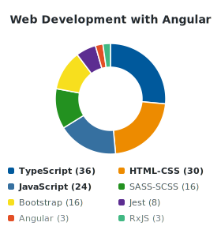
    </td>
  </tr>
  <tr>
    <td valign="top">
      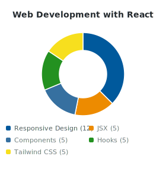
    </td>
    <td valign="top">
      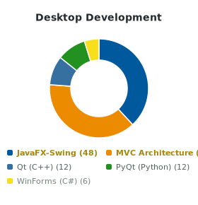
    </td>
    <td valign="top">
      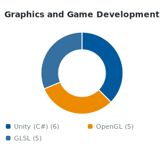
    </td>
  </tr>
  <tr>
    <td valign="top">
      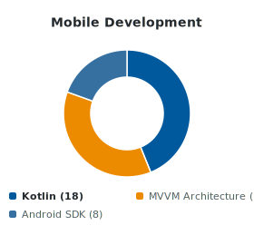
    </td>
    <td valign="top">
      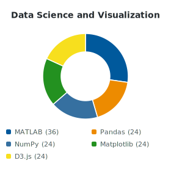
    </td>
    <td valign="top">
      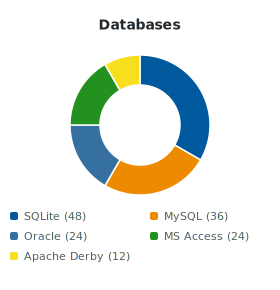
    </td>
  </tr>
  <tr>
    <td valign="top">
      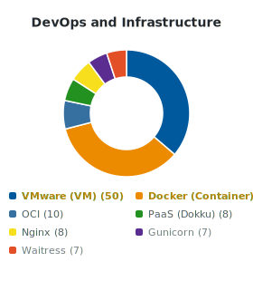
    </td>
    <td valign="top">
      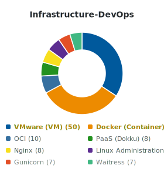
    </td>
    <td valign="top">
      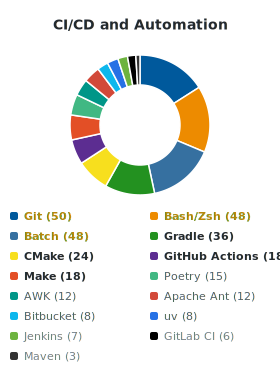
    </td>
  </tr>
  <tr>
    <td valign="top">
      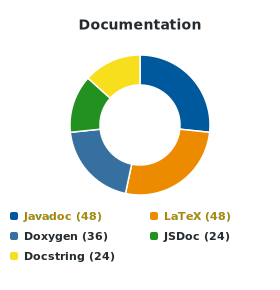
    </td>
    <td></td>
    <td></td>
  </tr>
</table>

